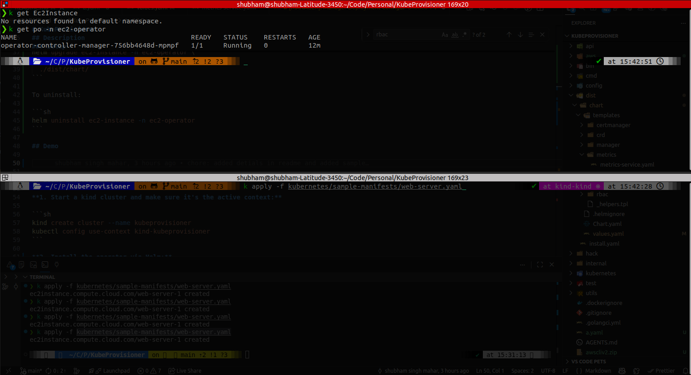
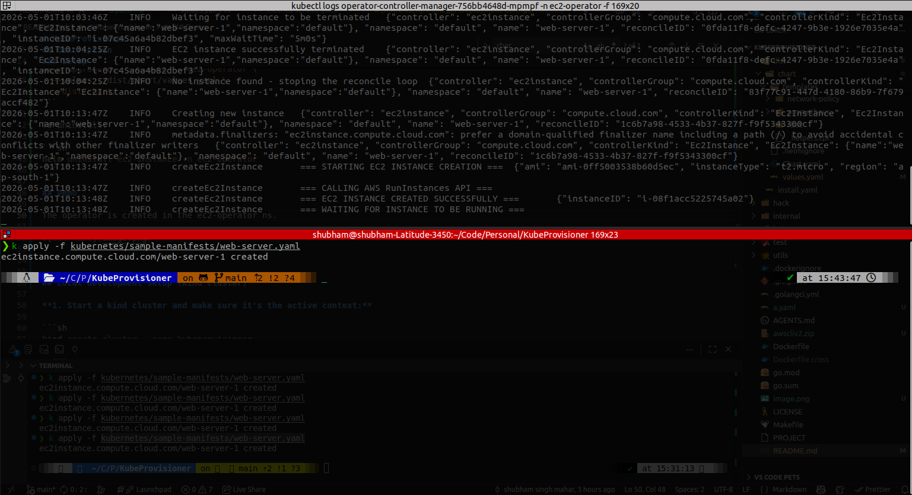
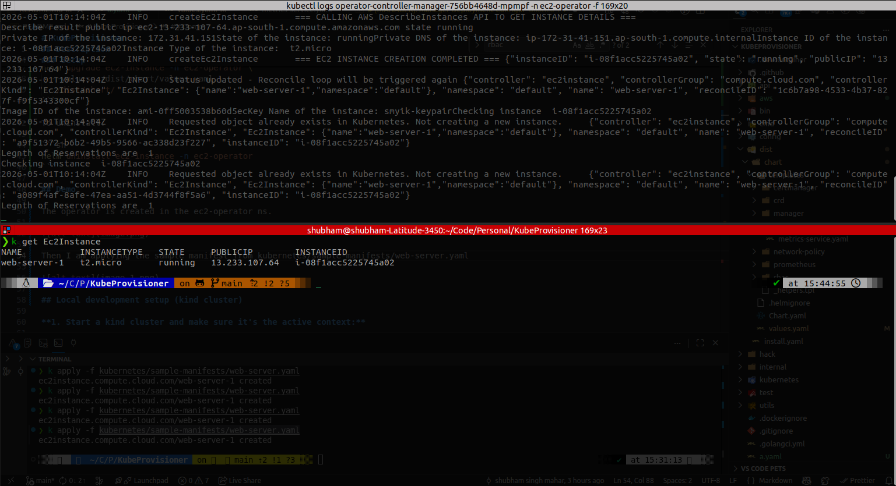
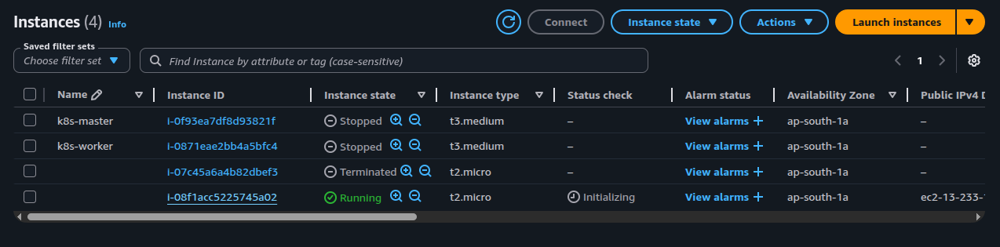

# KubeProvisioner

A Kubernetes operator that lets you manage AWS EC2 instances as native Kubernetes resources. Define your EC2 instances as custom resources (`Ec2Instance`) and the operator handles provisioning, lifecycle management, and cleanup automatically.

## Description

KubeProvisioner bridges Kubernetes and AWS by implementing a custom controller for the `Ec2Instance` CRD. When you apply an `Ec2Instance` manifest, the operator calls the AWS EC2 API to launch the instance, waits for it to reach the running state, and syncs the instance details (instance ID, public/private IP, DNS, state) back to the resource's status. When you delete the resource, the operator terminates the corresponding EC2 instance and waits for it to be fully terminated before removing the finalizer.

**What it manages:**
- EC2 instance creation (AMI, instance type, key pair, subnet, security groups, storage, tags)
- Instance status syncing (state, IPs, DNS names)
- EC2 instance termination on CR deletion (via finalizer)

### Setup

The chart is already generated and lives at `./dist/chart`. Install it with:

```sh
helm install ec2-instance --create-namespace -n ec2-operator \
  --values ./dist/chart/values.yaml \
  ./dist/chart/
```

You will have to create a sealed secret for your AWS_ACCESS_KEY_ID and AWS_SECRET_ACCESS_KEY. If you want to just supply AWS creds without using sealed secret, use `--set`:

```sh
helm install ec2-instance --create-namespace -n ec2-operator \
  --values ./dist/chart/values.yaml \
  --set controllerManager.container.env.AWS_ACCESS_KEY_ID=<your-key-id> \
  --set controllerManager.container.env.AWS_SECRET_ACCESS_KEY=<your-secret> \
  ./dist/chart/
```

To upgrade an existing release:

```sh
helm upgrade ec2-instance -n ec2-operator \
  --values ./dist/chart/values.yaml \
  ./dist/chart/
```

To uninstall:

```sh
helm uninstall ec2-instance -n ec2-operator
```

## Demo

The operator is created in the ec2-operator ns.



Then I am applying the sample manifest from kubernetes/sample-manifests/web-server.yaml



After some time the EC2 Instance is up and running



And if I check my AWS console, the EC2 Instance is created there as well



## Local development setup (kind cluster)

**1. Start a kind cluster and make sure it's the active context:**

```sh
kind create cluster --name kubeprovisioner
kubectl config use-context kind-kubeprovisioner
```

**2. Install the operator via Helm:**

```sh
helm install ec2-instance --create-namespace -n ec2-operator \
  --values ./dist/chart/values.yaml \
  --set controllerManager.container.env.AWS_ACCESS_KEY_ID=<your-key-id> \
  --set controllerManager.container.env.AWS_SECRET_ACCESS_KEY=<your-secret> \
  ./dist/chart/
```

This installs the CRDs, RBAC, and the controller in one step.

> **Alternative — run the controller locally** (useful for iterating without rebuilding an image):
>
> ```sh
> make install   # install CRDs only
> export AWS_ACCESS_KEY_ID=your-access-key
> export AWS_SECRET_ACCESS_KEY=your-secret-key
> go run cmd/main.go
> ```

**3. Apply an `Ec2Instance` resource:**

An example manifest is present in kubernetes/sample-manifests/web-server.yaml

```sh
kubectl apply -f my-instance.yaml
```

**6. Watch the instance status update:**

```sh
kubectl get ec2instances -w
```

You'll see the `State`, `PublicIP`, and `InstanceID` columns populate once the instance is running.

**7. Delete the instance:**

```sh
kubectl delete ec2instance my-instance
```

The operator will terminate the EC2 instance on AWS and then remove the resource from Kubernetes.

## Internal Commands

**Build and push your image to the location specified by `IMG`:**

```sh
make docker-build docker-push IMG=<some-registry>/ec2operator:tag
```

**Install the CRDs into the cluster:**

```sh
make install
```

**Deploy the Manager to the cluster with the image specified by `IMG`:**

```sh
make deploy IMG=<some-registry>/ec2operator:tag
```

> **NOTE**: If you encounter RBAC errors, you may need to grant yourself cluster-admin
privileges or be logged in as admin.

**Create instances of your solution**
You can apply the samples (examples) from the config/sample:

```sh
kubectl apply -k config/samples/
```

### To Uninstall

**Delete the instances (CRs) from the cluster:**

```sh
kubectl delete -k config/samples/
```

**Delete the APIs(CRDs) from the cluster:**

```sh
make uninstall
```

**UnDeploy the controller from the cluster:**

```sh
make undeploy
```

## Contributing

Contributions are welcome. Please open an issue or pull request on GitHub.

**NOTE:** Run `make help` for more information on all potential `make` targets.

More information can be found via the [Kubebuilder Documentation](https://book.kubebuilder.io/introduction.html).

## License

Copyright 2025.

Licensed under the Apache License, Version 2.0 (the "License");
you may not use this file except in compliance with the License.
You may obtain a copy of the License at

    http://www.apache.org/licenses/LICENSE-2.0

Unless required by applicable law or agreed to in writing, software
distributed under the License is distributed on an "AS IS" BASIS,
WITHOUT WARRANTIES OR CONDITIONS OF ANY KIND, either express or implied.
See the License for the specific language governing permissions and
limitations under the License.
